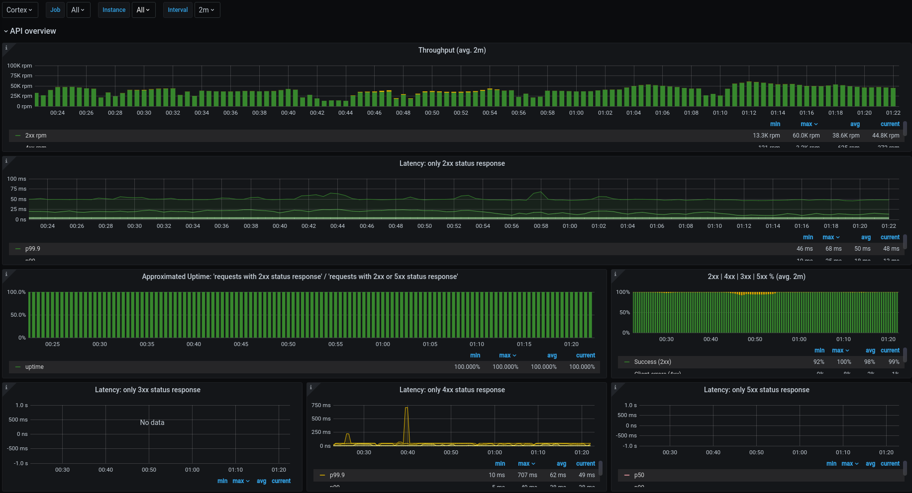
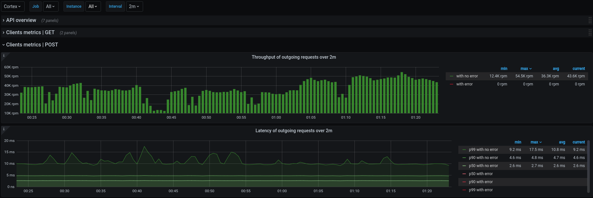

# Kamon Grafana Dashboards
Source code for building Grafana dashboards with Prometheus datasource to expose
metrics gathered by [Kamon] `2.x`.

### Common config

All dashboards have the following variables:
* **PROMETHEUS_DS**: available Prometheus datasources.
* **job**: Prometheus jobs with Kamon instrumentation. Multiple selections is enabled.
* **instance**: Prometheus instances belonging to the selected jobs.
* **interval**: interval time to use in the queries:  30s, 1m, 2m, 5m, 10m, 30m, 1h, 6h, 12h, 1d, 7d, 14d, 30d.

Jobs and instances are in [Prometheus terms].

The [Prometheus datasources] will be detected and listed automatically on the variable *PROMETHEUS_DS*.

If the app metrics follows the [Prometheus convention] for job and instance labels, the app will be listed automatically on the variable *job* as well as the associated instances on the variable *instance*. If you have other labels to identify your instances you will need to adapt the variable *instance*.

### Dashboards

#### **System metrics**

This dashboard shows both system metrics and JVM metrics for apps instrumented with [Kamon 2.x] using [Prometheus].

It requires the apps to be instrumented with [Kamon 2.x] and [kamon-system-metrics] module.

The following sections are included:

* **Resource overview:** general system recources overview at the current moment.
* **Load / Heatlh:** System load avg. and vm hiccups.
* **CPU:** both at vm and process level.
* **Memory:** vm memory and SWAP.
* **Network:** in / out bound and failed packets.
* **Disk:** space usage, data transferred and device operations.
* **JVM metrics:** heap, off heap and GC.
* **Executor metrics:** 6 graphs related to executor services.

Almost all metrics have a description.

**Screenshots:**


#### **API metrics**

This dashboard shows metrics for both the server and client side.

It requires the apps to be instrumented with [Kamon 2.x] and any module with instrumentation for server and client side, such as `kamon-akka-http` and `kamon-play`.

The following sections are included:

* **API overview:** throughput and latency for server side by status.
* **Client metrics:** throughput and latency for client side. One row for each operation.

Almost all metrics have a description.

**Required action for installing:**

It requires an action at the first time is imported: specify a properly value for the hidden variable `app_filter` in order to be able to list the jobs with kamon instrumentation properly. An example:

Suppose you have the apps `app-1`, `app-2` and `app-3` instrumented with `Kamon` and they are scrapped by `Prometheus` using jobs with the same names, so there have to be the jobs `app-1`, `app-2` and `app-3` on `Prometheus`. In this case, a good value for the custom variable `app_filter` would be `app-1.*|app-2.*|app-3.*`. Take in account that this value will be used to load the query variable `job` whose query expression is `label_values(up{job=~"$app_filter"}, job)`.

**Screenshots:**





### Generate dashboards

1. Make sure you have [Jsonnet] and [GNU Make] installed.
2. Clone this repo and initialize the submodule (depends on [Grafonnet-lib]):
```bash
git clone git@github.com:cspinetta/kamon-grafana-dashboards.git
git submodule init
git submodule update
```
3. Go to directory `jsonnet`.
4. Execute `make` to build all dashboards.

Jsons of dashboards will be placed at `./jsonnet/out/grafana`

### Formatting

* Tests the jsonnets are properly formatted.
```bash
make test
```

* Formats jsonnet files.
```bash
make fix-fmt
```

[Kamon]: https://kamon.io/
[Jsonnet]: https://jsonnet.org/
[GNU Make]: https://www.gnu.org/software/make/
[Grafonnet-lib]: https://github.com/grafana/grafonnet-lib
[Prometheus]: https://prometheus.io/
[Kamon 2.x]: https://github.com/kamon-io/Kamon
[kamon-system-metrics]: https://kamon.io/docs/latest/instrumentation/system/host-metrics/
[Prometheus terms]: https://prometheus.io/docs/concepts/jobs_instances/#jobs-and-instances
[Prometheus convention]: https://prometheus.io/docs/concepts/jobs_instances/#jobs-and-instances
[Prometheus datasources]: https://grafana.com/docs/grafana/latest/features/datasources/prometheus/
