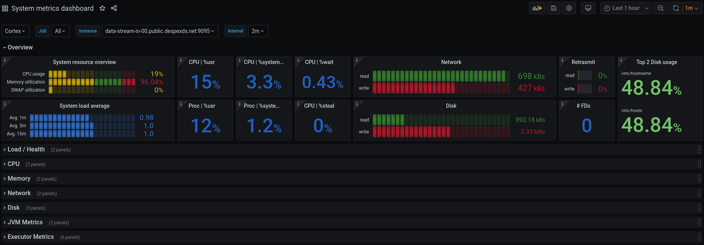
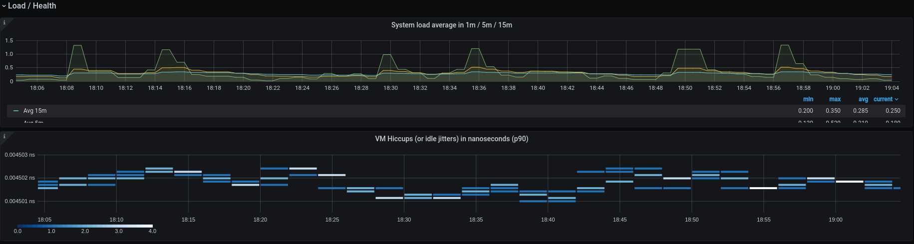
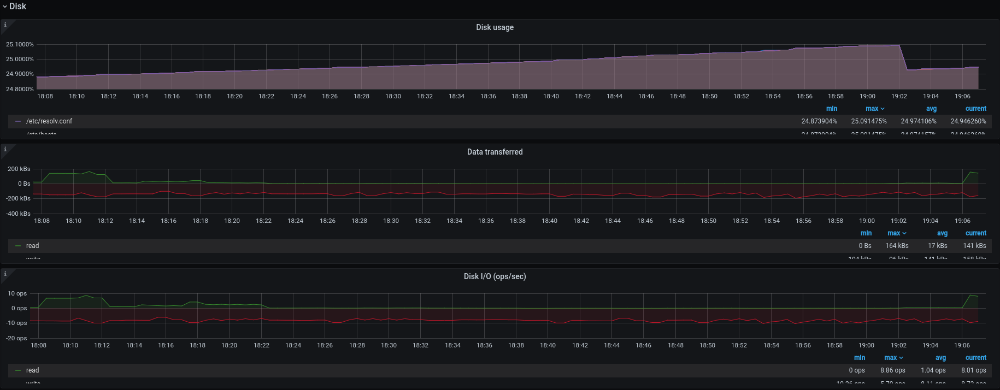

# [WIP] Kamon Grafana Dashboards
Source code for building Grafana dashboards with Prometheus datasource to expose
metrics gathered by [Kamon] `2.x`.

### Common config

All dashboards have the following variables:
* **PROMETHEUS_DS**: available Prometheus datasources.
* **job**: Prometheus jobs with Kamon instrumentation. Multiple selections is enabled.
* **instance**: Prometheus instances belonging to the selected jobs.
* **interval**: interval time to use in the queries: `[1m,2m,5m,10m,30m,1h,6h,12h,1d,7d,14d,30d]`

Jobs and instances are Prometheus terms. [More info](https://prometheus.io/docs/concepts/jobs_instances/#jobs-and-instances)

### Dashboards

* System metrics

This dashboard requires the apps to be instrumented with `Kamon 2.x` and `kamon-system-metrics` module.

**Some screenshots:**


> *System overview*


> *Load / Health row*


> *Disks metrics row*

### Generate dashboards

1. Make sure you have [Jsonnet] and [GNU Make] installed.
2. Clone this repo and initialize the submodule (depends on [Grafonnet-lib]):
```bash
git clone git@github.com:cspinetta/kamon-grafana-dashboards.git
git submodule init
git submodule update
```
3. Go to directory `jsonnet`.
4. Execute `make` to build all dashboards.

Jsons of dashboards will be placed at `./jsonnet/out/grafana`

### Formatting

* Tests the jsonnets are properly formatted.
```bash
make test
```

* Formats jsonnet files.
```bash
make fix-fmt
```

[Kamon]: https://kamon.io/
[Jsonnet]: https://jsonnet.org/
[GNU Make]: https://www.gnu.org/software/make/
[Grafonnet-lib]: https://github.com/grafana/grafonnet-lib
